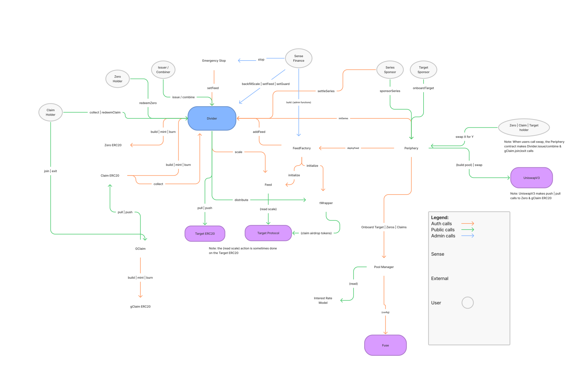

# Sense Finance


[comment]: <> ([![codecov]&#40;https://codecov.io/gh/Sense/sense-v1/branch/develop/graph/badge.svg&#41;]&#40;https://codecov.io/gh/Sensefinance/sense;)
[comment]: <> ([![npm version]&#40;https://badge.fury.io/js/sense-finance.svg&#41;]&#40;https://badge.fury.io/js/sense-finance&#41;)
[](https://discordapp.com/channels/790088877381517322/)
[](https://twitter.com/senseprotocol)

The Sense Protocol is a decentralized fixed-income protocol on Ethereum, allowing users to manage risk through fixed rates and future yield trading on existing yield bearing-assets.

For the latest documentation see [docs.sense.finance](https://docs.sense.finance/)

You can use Sense at: [app.sense.finance](https://v)

### Community   

[](https://discordapp.com/channels/790088877381517322/) [](https://twitter.com/senseprotocol)

---

## Installation

### Toolset

Install Nix if you haven't already:

```sh
# user must be in sudoers
curl -L https://nixos.org/nix/install | sh

# Run this or login again to use Nix
. "$HOME/.nix-profile/etc/profile.d/nix.sh"
```

Then install dapptools:

```
curl https://dapp.tools/install | sh
```
This configures the dapphub binary cache and installs the `dapp`, `solc`, `seth` and `hevm` executables.

More info about dapptools on https://github.com/dapphub/dapptools

Note: This repo is configured with this version of `dapp` && `solc`:
```
dapp 0.34.0
solc, the solidity compiler commandline interface
Version: 0.8.6+commit.11564f7e.Darwin.appleclang
hevm 0.48.1
```


## Project setup
Clone this repo & install dependencies
```
git clone https://github.com/sense-finance/sense-v1.git
yarn
dapp update
yarn build
```

## Sense V1 Architecture

# 

The `Divider` is the accounting engine of the Sense Protocol. It allows users to "divide" `Target` assets into ERC20 `Zeros` & `Claims` with the help of numerous auxilary contracts including `Adapters`, `Adapter Factories`, `Periphery`, `TWrappers` and `Emergency Stop`. Each Target can have up to three instances or `series` of Zeros and Claims, and each series is uniquely identified by their `maturity`. The Divider reads [`Scale` values](https://docs.sense.finance/litepaper/#rate-accumulator) from Adapters to determine how much Target to distribute to Zero & Claim holders at or before maturity. Constituing as the "core" of Sense, these contracts fully implement the [Sense Lifecycle](https://docs.sense.finance/litepaper/#divider) as well as permissionless series management & onboarding of arbitrary Target yield-bearing assets. 

The core is surrounded by `modules` that build atop and/or leverage its functionality to achieve a certain goal such as [Collect to Drag](https://medium.com/sensefinance/designing-yield-tokens-d20c34d96f56) conversions for Claims or the management of a [Zero/Claim borrowing/lending pool](https://medium.com/sensefinance/sense-finance-x-rari-capital-5c0e0b6289d4).

### Divider
The Divider contract contains the logic to `issue()` ERC20 Zeros and Claims, re`combine()` those assets into Target before their `maturity`, `collect()` Target with Claim tokens, and `redeemZero()` at or after maturity. The goal is to have the Sense Divider be the home for all yield-bearing asset liquidity in DeFi.

### Adapter
Adapter contracts contain only the logic needed to calculate Scale values. The protocol will have several Adapters, each with similar code, that are granted core access to the Divider by authorized actors. In most cases, the only difference between Adapters will be how they calculate their Scale value.

Each adapter has a `delta` that represents the maximum growth per second a scale can be when retrieving a value from the protocol's scale method. This delta value is the same across all the targets within the same target type and is defined on the adapter factory which then sets it to the adapter on initialization.

To create a adapter implementation, the contract needs to inherit from `BaseAdapter.sol` and override `_scale()` which is a function that calls the external protocol to get the current scale value.

### Adapter factory
The adapter factory allows any person to deploy a adapter for a given Target in a permissionless manner.

Following a gradual expansion, Sense Finance will deploy one Adapter Factory for each protocol (e.g cTokens Adapter Factory, aTokens Adapter Factory, etc).

Most factories will be similar except for how they implement `_exists(target)`, a method that communicates to a data contract from the external protocol (e.g the Comptroller on Compound Finance) to check whether the Target passed is a supported asset of that protocol.

Users can deploy a Adapter by making a call to the `Periphery` contract, which has authority to call `deployAdapter(_target)` on the Adapter Factory.

To create a Adapter Factory, the contract needs to inherit from `BaseFactory.sol` and override `_exists()`.

### Periphery

Periphery contains bundled actions for Series Actors and general users. 

For Series Actors, the Periphery exposes the public entry points to onboard new Targets (i.e. deploy adapters) and initialize new Series. The Target Sponsor calls `onboardAdapter` which will deploy a Adapter via a Adapter Factory and onboard the Target to the Sense Fuse Pool. The Series Sponsor calls `sponsorSeries` to initialize a series in the Divider and create a Zero/gClaim pool on UniswapV3.

Because the UniswapV3 pool holds Zeros/gClaims, users need to execute additional steps to `issue()` / `combine()` and `join()` / `exit()` gClaims in order to enter/exit into/from a Zero/Claim position. The Periphery allows general users bundle the necessary calls behind a single function interface and perform the following operations atomically:
- swapTargetForZeros
- swapTargetForClaims
- swapZerosForTarget
- swapClaimsForTarget

### Tokens
This directory contains the tokens contracts. Sense Protocol uses [Rari's ERC20 implementation](https://github.com/Rari-Capital/solmate/blob/main/src/erc20/ERC20.sol) and defines:
- `Token.sol` as a minimalist ERC20 implementation with auth'd `burn()` and `mint()`. Used for Zeros.
- `Claim.sol` as a minimalist yield token implementation that:
    1. inherits from `Token`
    2. adds `maturity`, `divider` and `adapter` address variables
    3. defines `collect()` (which calls `Divider.collect()`) and overrides `transfer()` and `transferFrom()` to also call `collect()`

### Target Wrappers

tWrappers hold Target before a series' maturity and contain logic to handle arbitrary airdrops from native or 3rd party liquidity mining programs. Typically denominated in another asset, airdropped tokens are distributed to Claim holders in addition to the yield accrued from the Target.

### Emergency Stop

Emergency Stop is used by Sense Finance, Inc, to `stop` the operation of the Divider by pausing all `Adapters`. 

### Modules

A Collection of Modules and Utilities for Sense V1

#### G Claim Manager

`GClaimManager` lets a user deposit their "Collect" Claims and receive "Drag" Claim representations. Specifically, it enables users to backfill interest accrued on their "Collect" Claim so that it can be used in other DeFi projects that don't know how to collect accrued yield for the user. Similarly, users may bring existing gClaims back to the contract to re-extract the PY and reconstitute their Collect Claims. More information between Collect and Drag Claims can [be found here](https://medium.com/sensefinance/designing-yield-tokens-d20c34d96f56).


#### Pool Manager

`PoolManager` manages the Sense Fuse Pool, a collection of borrowing/lending markets serving all Zeros & Claims and their respective Targets. It allows users to permissionlessly onboard new Target (`addTarget()`) and Zeros/Claims (`addSeries()`). 

#### Recycling Module [WIP]

The Recycling Module is a contract for yield traders who want constantly-preserved IR sensitivity on their balances, and do not want to find reinvestment opportunities for their PY. The contract uses a dutch auction to automatically sell collected PY off at some interval for more Claims, which refocuses users' positions on FY.

### Access
We use `Trust.sol` to provide with access control via `requiresTrust` to contracts inheriting from it.

### Admin

The long-term goal of the Sense Protocol is to be as governance minimized as possible. However, out of caution, we’re taking a progressive decentralization approach, where Sense Finance Inc retains certain privileged permissions of v1 of the Protocol to ensure the system scales safely as well as pause the system in case of an emergency (vulnerability, hack, etc). The following list elaborates on these permissions:
- `Divider.setIsTrusted` - add a new Adapter Factory
- `Divider.setAdapter` - pause a faulty adapter
- `Divider.backfillScale` - fix a faulty scale value / pass in a scale if no settlement occurs
- `EmergencyStop.stop` - stop the Sense Protocol
- `Divider.setGuard` - set the cap for the Guarded launch
- `Divider.setPeriphery` - point to the Periphery
- `BaseFactory.setDivider` - Adapter Factory config
- `BaseFactory.setDelta` - Adapter Factory config
- `BaseFactory.setAdapterImplementation` - Adapter Factory config
- `BaseFactory.setTWImplementation` - Adapter Factory config
- `BaseFactory.setProtocol` - Adapter Factory config
- `PoolManager.deployPool` - deploy the Sense Fuse Pool
- `PoolManager.setParams` - set parameters for the Sense Fuse Pool

### External
These are libraries we need as part of the protocol that we've imported from other projects and modified for our needs.
- DateTime.sol
- FixedMath.sol
- FullMath.sol
- OracleLibrary.sol
- PoolAddress.sol
- TickMath.sol


## Developing
|       |   	|
|---	|---	|
| `yarn build` | compiles code  |
| `yarn debug` | run tests using HEVM interactive debugger |
| `yarn test`  | run tests   	|
| `yarn testcov`  | run tests with coverage  	|
| `yarn test-mainnet`  | run tests using a fork from mainnet* |
| `yarn lint`  | run linter |
| `yarn fix`   | runs both prettier and solhint and automatically fix errors |

* Testing on mainnet requires to have a ALCHEMY_KEY set: make a copy of `.env.example`, rename it to `.env`  and set `ALCHEMY_KEY` to your alchemy api key.

## Branching (TBD)

Right now, we will be just using `dev` and  `master` branches.

- `master` represents the contracts live on `mainnet` and all testnets.
- `alpha` is for the newest version of contracts, and is reserved for deploys to `kovan`
- `beta` is for promoted alpha contracts, and is reserved for deploys to `rinkeby`
- `release-candidate` is for promoted beta contracts, and is reserved for deploys to `ropsten`

When a new version of the contracts makes its way through all testnets, it eventually becomes promoted in `master`, with [semver](https://semver.org/) reflecting contract changes in the `major` or `minor` portion of the version (depending on backwards compatibility).