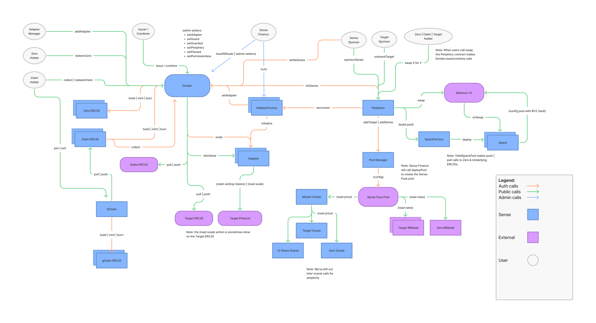

# Sense v1 • [](https://github.com/sense-finance/space-v1/actions/workflows/ci.yml) [](https://www.gnu.org/licenses/agpl-3.0)


The Sense Protocol is a decentralized fixed-income protocol on Ethereum, allowing users to manage risk through fixed rates and future yield trading on existing yield bearing-assets.

Extensive documentation and use cases are available within this README and in the Sense docs [here](https://docs.sense.finance/).

One way to interact with Sense is through our official [app](https://app.sense.finance/eth-mainnet/rates)

Active development occurs in this repository, which means some contracts in it might not be production-ready. Proceed with caution.

### Community   

[](https://discord.com/invite/krVGnQgSzG)
[](https://twitter.com/senseprotocol)


## Deployments

### Mainnet v1.1.0

| Contract   | Address                                                                                                                                        |
| ------- | ------------------------------------------------------------------------------------------------------------------------- |
| Divider | [0x6961e8650A1548825f3e17335b7Db2158955C22f](https://etherscan.io/address/0x6961e8650A1548825f3e17335b7Db2158955C22f#code)                     |
| Periphery  | [0xe983Ec9a2314a46F2713A838349bB05f3e629FE5](https://etherscan.io/address/0xe983Ec9a2314a46F2713A838349bB05f3e629FE5#code)      |
| PoolManager | [0xEBf829fB23bb3caf7eEeD89515264C18e2CE1dFb](https://etherscan.io/address/0xEBf829fB23bb3caf7eEeD89515264C18e2CE1dFb#code)                     |
| WstETHAdapter  | [0xF3B7Ecc8238f5d6EC6c8d31D667dDd1C2A708a8C](https://etherscan.io/address/0xF3B7Ecc8238f5d6EC6c8d31D667dDd1C2A708a8C#code)      |
| cUSDC-CAdapter  | [0xf61c68a42FE0D7aA22182953B0f4aD5960f1e439](https://etherscan.io/address/0xf61c68a42FE0D7aA22182953B0f4aD5960f1e439#code)     

### Goerli v1.1.0

| Contract   | Address                                                                                                                                        |
| ------- | ------------------------------------------------------------------------------------------------------------------------- |
| Divider | [0xc8b594Bf6cC2a41e3afC3807e667B055CfBF8304](https://etherscan.io/address/0xc8b594Bf6cC2a41e3afC3807e667B055CfBF8304#code)                     |
| Periphery  | [0x992c0A5Ad53b9f0553299EEFD79B7EBBEF22D324](https://etherscan.io/address/0x992c0A5Ad53b9f0553299EEFD79B7EBBEF22D324#code)      |
| PoolManager | [0xDd2c59C90c7b4E03584F684A47aa7BAD03Eb91E3](https://etherscan.io/address/0xDd2c59C90c7b4E03584F684A47aa7BAD03Eb91E3#code)                     |
| BalancerVault  | [0xB9EA2205A94E001C22421389b4165BC6e74bbd24](https://etherscan.io/address/0xB9EA2205A94E001C22421389b4165BC6e74bbd24#code)      


## Development

This repo uses [Foundry: forge](https://github.com/gakonst/foundry) for development and testing
and git submodules for dependency management (we previously used `dapp` and `nix`, so there are vestiges from those tools around).

To install Foundry [Foundry: Forge](https://github.com/gakonst/foundry), use the instructions in the linked repo.

In addition, this repo uses [just](https://github.com/casey/just) as our command runner:

```sh
brew install just
# or
cargo install just
```

### Test

```bash
# Get contract dependencies
git submodule update --init --recursive
yarn isntall # or npm install

# Run local tests
just turbo-test-local

# Run mainnet fork tests
just turbo-test-mainnet
```

### Format

```bash
# Run linter
yarn lint

# Run formatter
yarn fix
```

### Deploy

This repo uses [hardhat deploy](https://github.com/wighawag/hardhat-deploy) for replicable deployments. To create a new deployment:

```bash
# Navigate to the `deployments` package
cd pkg/deployments

# Deploy the protcol with mocks on a forked network
yarn deploy:hardhat-fork:sim

# Deploy the protcol with production config on a forked network
yarn deploy:hardhat-fork:sim

# Deploy the protcol with mocks on a live network
yarn hardhat deploy --network <network> --tags scenario:simulated

# Deploy the protcol with production config on a live network
yarn hardhat deploy --network <network> --tags scenario:prod
```

### Environment

1. Create a local `.env` file in the root directory of this project
2. Set `ALCHEMY_KEY` to a valid Alchemy API key
3. Set `MNEMONIC` to a valid seed phrase for deployments


## Sense V1 Architecture

# 

[User Journey & Interaction Matrix](https://docs.google.com/spreadsheets/d/1u--kIr18av6RPTyTZbs_ryMVv2maSsd-NxDFpUkF-Uo/edit?usp=sharing)

The `Divider` is the accounting engine of the Sense Protocol. It allows users to "divide" `Target` assets into ERC20 `Principal` & `Yield` tokens with the help of numerous auxilary contracts including `Adapters`, `Adapter Factories`, and the `Periphery` contract. Each Target can have an arbitrary number of active instances or `series` of Principal and Yield Tokens (sometimes referred to as PTs and YTs, respectively), and each series is uniquely identified by their `maturity`. The Divider reads [`Scale` values](https://docs.sense.finance/litepaper/#rate-accumulator) from Adapters to determine how much Target to distribute to Principal & Yield Token holders at or before maturity. Constituing as the "core" of Sense, these contracts fully implement the [Sense Lifecycle](https://docs.sense.finance/litepaper/#divider) as well as permissionless series management & onboarding of arbitrary Target yield-bearing assets. 

The core is surrounded by the following `modules`:
- `Space`, a Principal Token/Target AMM Pool that offers an LP position that is principal protected, yield-generating, and IL minimized
- `Pool Manager`, manager of the [Sense Fuse Lending Facility](https://medium.com/sensefinance/sense-finance-x-rari-capital-5c0e0b6289d4)

### Divider
The Divider contract contains the logic to `issue()` ERC20 Principal and Yield Tokens, re-`combine()` those assets into Target before their `maturity`, `collect()` Target with Yield Tokens, and `redeem()` at or after maturity. Note: we assume Target tokens will always have <=18 decimals.

### Adapter
Following a hub and spoke model, Adapters surround the Divider and hold logic related to their particular Divider Application, such as stripping yield from yield-bearing assets. Once an Adapter is onboarded, users can initialize/settle series, issue Principal/Yield tokens, and collect/redeem their Target via the Divider.

The Adapter holds the Target before a series' maturity and contains logic to handle arbitrary airdrops from native or 3rd party liquidity mining programs. Typically denominated in another asset, airdropped tokens are distributed to YT holders in addition to the yield accrued from the Target. In addition to asset custody, Adapters store parameters related to their individual applications, which gives guidance to the Divider when performing the above-mentioned operations. The parameters include:

1. `target` - address to the Target 
2. `oracle` - address to the Oracle of the Target's Underlying
3. `ifee` - issuance fee
4. `stake` - token to stake at issuance
5. `stakeSize` - amount to stake at issuance
6. `minm` - min maturity
7. `maxm` - max maturity
8. `mode` - maturity date type (0 for monthly, 1 for weekly)

To create an Adapter implementation without airdrops, the contract needs to inherit from `BaseAdapter.sol` and override `_scale()`, `underlying()`, `wrapUnderlying()`, `unwrapTarget()`, `getUnderlyingPrice()`, and `notify()`. In addition, `_scale()` must return an 18 decimal exchange rate, otherwise some compoments of the system might not behave as intended when interfacing with the Adapter.

There are two types of Adapters:
1. Verified Adapters - these are verified by the Sense team and can be permissionessly deployed by Adapter Factories
2. Unverified Adapters - there are unverified by the Sense team and could be controlled by malicious actors

At the time of launch, the Divider will interface only with the Verified Adapters. However, once the `permissionless` flag is enabled, users can permissionessly onboard Adapters via `Divider.addAdapter()` and leverage Sense's infrastructure to build new fixed-income products, structured products, and yield primitives never before seen in DeFi.

### Adapter factory
The Adapter factory allows any person to deploy a Verified Adapter for a given Target in a permissionless manner.

Following a gradual expansion, Sense Finance will deploy one Adapter Factory for each protocol (e.g cTokens Adapter Factory, Curve LP Share Adapter Factory, etc).

Most factories will be similar except for how they implement `_exists(target)`, a method that communicates to a data contract from the external protocol (e.g the Comptroller on Compound Finance) to check whether the Target passed is a supported asset of that protocol.

Users can deploy a Verified Adapter by making a call to the `Periphery` contract, which has authority to call `deployAdapter(_target)` on the Adapter Factory.

To create an Adapter Factory, the contract needs to inherit from `BaseFactory.sol` and override `_exists()`.

### Periphery
The Periphery contract contains bundled actions for Series Actors and general users. 

For Series Actors, the Periphery exposes the public entry points to deploy Sense-Sponsored Adapters for new Targets and to initialize Series within existing adapters. The Target Sponsor calls `onboardAdapter` which will deploy an Adapter via an Adapter Factory and onboard the Target to the Sense Fuse Pool. The Series Sponsor calls `sponsorSeries` to initialize a series in the Divider and create a Space for Principal Token/Target trading.

Because the BalancerV2 pool only holds Principal & Target tokens, users need to execute additional steps to `issue()` and `combine()` in order to enter/exit into/from a YT position. The Periphery allows users to bundle the necessary calls behind a single function interface and perform the following operations atomically, flash loaning Target from an Adapter when need be:
- swap[Target|Underlying]ForPTs
- swap[Target|Underlying]ForYTs
- swapPTsFor[Target|Underlying]
- swapYTsFor[Target|Underlying]

Similarily, the Periphery exposes several atomic transactions for LP management through Space.
- addLiquidityFrom[Target|Underlying]
- removeLiquidityTo[Target|Underlying]
- migrateLiquidity

### Tokens
This directory contains the tokens contracts. Sense Protocol uses [Rari's ERC20 implementation](https://github.com/Rari-Capital/solmate/blob/main/src/erc20/ERC20.sol) and defines:
- `Token.sol` as a minimalist ERC20 implementation with auth'd `burn()` and `mint()`. Used for Principal.
- `YT.sol` as a minimalist yield token implementation that:
    1. inherits from `Token`
    2. adds `maturity`, `divider` and `adapter` address variables
    3. defines `collect()` (which calls `Divider.collect()`) and overrides `transfer()` and `transferFrom()` to also call `collect()`

When Series are initialized, Principal and Yield tokens are deployed and they take the same number of decimals as the their Target token (which cannot be >= 18 decimals). 

### Modules
A Collection of Modules and Utilities for Sense V1

#### Space
`Space` is an Principal Token/Target AMM Pool built on Balancer V2. It implements the [Yieldspace](https://yield.is/YieldSpace.pdf) invariant but introduces a meaningful improvement by allowing LPs to deposit a yield-generating _quote_ asset, i.e. the Target, instead of the Principal Token's Underlying, as was originally concieved. Because its TWAP price is utilized by the Sense Fuse Pool, Space is heavily inspired by Balancer's [Weighted 2 Token Pool](https://github.com/balancer-labs/balancer-v2-monorepo/blob/c40b9a783e328d817892693bd13b4a14e4dcff4d/pkg/pool-weighted/contracts/WeightedPool2Tokens.sol) and its oracle functionality. Each Series will have a unique `Space` for Principal Token/Target trading, which will be deployed and initialized through the `Space Factory`. More context on `Space`'s development can be found [here](https://github.com/sense-finance/space-v1).

#### Pool Manager
`PoolManager` manages the Sense Fuse Pool, a collection of borrowing/lending markets serving all Principal tokens, the Space LP Shares, and their respective Targets. It allows users to permissionlessly onboard new Target (`addTarget()`), Principal and their Space LP shares (`queueSeries()` & `addSeries()`). Once new assets are onboarded, the Sense Fuse Pool will query price data from the `Master Oracle` which exposes a mapping, linking token addresses to oracle addresses. 

#### G Yield Manager [WIP]
`GYTManager` lets a user deposit their "Collect" YT and receive "Drag" YT representations. Specifically, it enables users to backfill interest accrued on their "Collect" YTs so that it can be used in other DeFi projects that don't know how to collect accrued yield for the user. Similarly, users may bring existing gYTs back to the contract to re-extract the PY and reconstitute their Collect YTs. More information between Collect and Drag YTs can [be found here](https://medium.com/sensefinance/designing-yield-tokens-d20c34d96f56). Note that some YTs within Sense have PY composed of native yield as well as airdrop rewards, the latter of which can balloon and shrink in value, causing wide fluctuations in the gYTs valuation. 

#### Recycling Module [WIP]
The Recycling Module is a contract for yield traders who want constantly-preserved IR sensitivity on their balances, and do not want to find reinvestment opportunities for their PY. The contract uses a dutch auction to automatically sell collected PY off at some interval for more Yield Tokens, which refocuses users' positions on FY.


### Access
We use `Trust.sol` to provide access control via `requiresTrust` to contracts inheriting from it. In some contracts, we introduce per-function access control for greater granularity, such as `peripherOnly`.

### Admin

The long-term goal of the Sense Protocol is to be as governance minimized as possible. However, out of caution, we’re taking a progressive decentralization approach, where Sense Finance Inc retains certain privileged permissions of Sense-v1 to ensure the system scales safely as well as pause the system in case of an emergency (vulnerability, hack, etc). The following list elaborates on these permissions:

1. `Divider.setIsTrusted` - give auth to a new Adapter Factory
2. `Divider.setAdapter` - pause a faulty adapter
3. `Divider.backfillScale` - fix a faulty scale value / pass in a scale if no settlement occurs
4. `Divider.setPause` - pause the Divider (emergencies only)
5. `Divider.setGuard` - set the cap for the Guarded launch
6. `Divider.setGuarded` - release the Guards
7. `Divider.setPeriphery` - point to the Periphery
8. `Periphery.setFactory` - onboard a new Adapter Factory
8. `PoolManager.deployPool` - deploy the Sense Fuse Pool
9. `PoolManager.setParams` - set parameters for the Sense Fuse Pool

### External
These are libraries we need as part of the protocol that we've imported from other projects and modified for our needs.
- DateTime.sol
- FixedMath.sol
- FullMath.sol
- OracleLibrary.sol

## Security

Sense contracts have gone through different independent security audits performed by [Fixed Point Solutions](https://github.com/fixed-point-solutions), [Spearbit](https://spearbit.com), [ABDK](https://www.abdk.consulting/) and [Peckshield](https://peckshield.com). Reports are located in the [`audits`](./audits) directory.

### Bug Bounties


## Conventions

### Branching

Right now, we are using `dev` and  `main` branches.

- `main` represents the contracts live on `mainnet` and all testnets
- `dev` is for the newest version of contracts, and is reserved for deployments to `goerli`

When a new version of the contracts makes its way through the testnet, it eventually becomes promoted in `main`, with [semver](https://semver.org/) reflecting contract changes in the `major` or `minor` portion of the version (depending on backwards compatibility).
